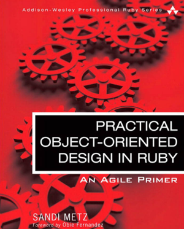

#Object Oriented Design
####Promo#1 Simplon.VE
Avril-Octobre 2015

///
Sources : 

Practical Object-Oriented Design in Ruby - by Sandy Metz




///
http://rubylearning.com/satishtalim/tutorial.html
https://en.wikibooks.org/wiki/A-level_Computing/AQA/Problem_Solving,_Programming,_Operating_Systems,_Databases_and_Networking/Programming_Concepts/Object-oriented_programming_(OOP)
https://robots.thoughtbot.com/back-to-basics-polymorphism-and-ruby
===

##What is OOP?

///

- Object Oriented Programming 
- a design philosophy 
- everything is grouped as self sustainable "objects"

///
###Why ? 
=> to gain reusability 

///

##Example
A “hand” 

///

The “hand” is a class. <= Abstraction here !

Your body has two objects of the type "hand" : 

- "left hand"
- "right hand"

Functions are controlled by a set of electrical signals sent through your shoulders

Shoulder = interface

The hand class is being reused to create the left hand and the right hand by **slightly** changing the properties of it.

===
##What is an Object?

A "thing" that can perform a set of related activities.

The Hand (object) can grip something, 

A Student (object) can give their name or address.

An object is **always** an instance of a **class**.

===
##What is a Class?

- A representation of a type of object
- A plan, or a template, that describes the details of an object. 


///

- A class is a template which cannot be executed
- An object is an instance of a class which can be executed
- one class can be used to make many objects- 

///

Class is composed of three things:

 - a name
 - attributes
 - methods

===

##How to identify and design a Class?

This is an art

But you have SOLID

///

SOLID are 5 principles that you must follow when design a class

1 SRP - The Single Responsibility Principle

A class should have one, and only one, reason to change

2 OCP - The Open Closed Principle

Should be able to extend any classes' behaviors, without modifying the classes

3 LSP - The Liskov Substitution Principle

A subclass can be used anywhere its superclass would do

///
4 ISP - The Interface Segregation Principle

Make fine grained interfaces that are client specific

5 DIP - The Dependency Inversion Principle

Depend on abstractions, not on concretions.

===

##To identify a class correctly

- identify the full list of functions 
- group each function to form classes 


##Divide and conquer !

===
Stop talking !
##Show me some examples
===

##Adavantages of SRP

- Expose previously hidden qualities
- Avoid the need for comments 
- Encourage reuse
- Are easy to move to another class 

///
Refactors are needed, not because the design is clear, but because it isn’t.
===

##Exercice

À partir des commandes et résultats suivant, retrouver les classes à écrire.

``` ruby
player_1 = Player.new "Ryu"
player_2 = Player.new "Ken"

player_1.hp = 100
player_1.force = 10

player_2.hp = 200
player_2.force = 5

player_1.hit player_2
# => Ken perd 10 hp !

puts player_2.hp
# => 190

20.times do
  player_2.hit player_1
  # => Ryu perd 5 hp !
end
# => Ryu a perdu !
```