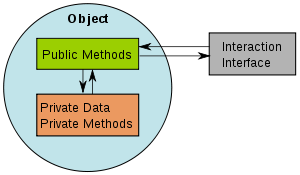

#Object Oriented Design
####Promo#1 Simplon.VE
Avril-Octobre 2015

///

Sources : 
Practical Object-Oriented Design in Ruby - by Sandy Metz
http://rubylearning.com/satishtalim/tutorial.html
https://en.wikibooks.org/wiki/A-level_Computing/AQA/Problem_Solving,_Programming,_Operating_Systems,_Databases_and_Networking/Programming_Concepts/Object-oriented_programming_(OOP)
https://robots.thoughtbot.com/back-to-basics-polymorphism-and-ruby
===

##What is OOP?

///

- a design philosophy. 
- Object Oriented Programming. 
- everything is grouped as self sustainable "objects"

///
###Why ? 
=> to gain reusability 

///

##Example
A “hand” 

///

The “hand” is a class. <= Abstraction here !

Your body has two objects of the type "hand" : 
- "left hand" and "right hand"

Functions are controlled by a set of electrical signals sent through your shoulders

Shoulder = interface

The hand class is being reused to create the left hand and the right hand by **slightly** changing the properties of it.

===
##What is an Object?

A "thing" that can perform a set of related activities.

The Hand (object) can grip something, 
A Student (object) can give their name or address.

An object is always an instance of a **class**.

===
##What is a Class?

- A representation of a type of object
- A plan, or a template, that describes the details of an object. 


///

- A class is a template which cannot be executed
- An object is an instance of a class which can be executed
- one class can be used to make many objects- 

///

Class is composed of three things:

 - a name
 - attributes
 - methods

===

##How to identify and design a Class?

This is an art

But you have SOLID

///

SOLID are 5 principles that you must follow when design a class

1. SRP - The Single Responsibility Principle
A class should have one, and only one, reason to change.

2. OCP - The Open Closed Principle
Should be able to extend any classes' behaviors, without modifying the classes.

3. LSP - The Liskov Substitution Principle
A subclass can be used anywhere its superclass would do

///
4. ISP - The Interface Segregation Principle
Make fine grained interfaces that are client specific.

5. DIP - The Dependency Inversion Principle
Depend on abstractions, not on concretions.

///

##To identify a class correctly

- identify the full list of functions 
- group each function to form classes 

///

##Divide and conquer

Identify the module of the system first 
Dig deep in to each module separately to seek out classes.

===
##How to manage classes of a software system

and to reduce the complexity

1. Encapsulation

2. Inheritance

3. Polymorphism

===

##Encapsulation
(or Information Hiding)



default in Ruby

///

Example : A Square has

- a set of variables,
- length 
- and width

only accessible by functions inside the object

///
This concept reduces the chance of 'breaking' something when programming

The object itself can directly manipulate its variables, so debugging problems is easier.

===
##Inheritance

Dont declare all the new stuff we wanted to add to an object

```rb
class Mammal  
  def breathe  
    puts "inhale and exhale"  
  end  
end  
  
class Cat < Mammal  
  def speak  
    puts "Meow"  
  end  
end  
  
rani = Cat.new  
rani.breathe  
rani.speak
```

===

###Polymorphism

Polymorphism describes a pattern in object oriented programming in which classes have different functionality while sharing a common interface.

Being able to send the same message to different objects and get different results

