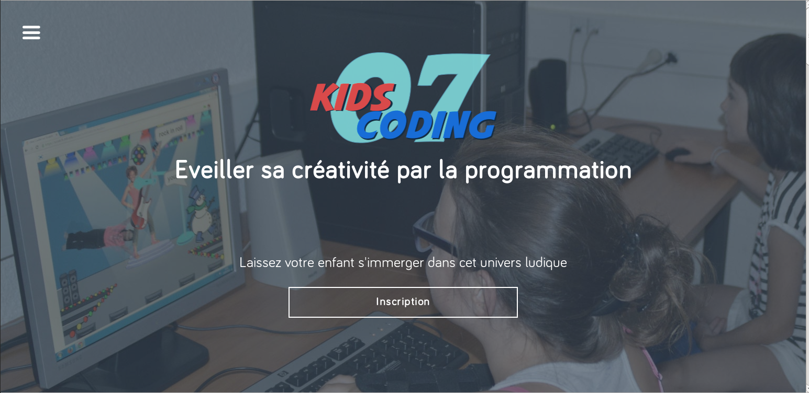

#Good UI Tips
####Promo#1 Simplon.VE
Avril-Octobre 2015

Source : 
https://medium.com/@erikdkennedy/7-rules-for-creating-gorgeous-ui-part-1-559d4e805cda
http://blog.invisionapp.com/8-visual-design-tips-for-ux-designers


===
##Rule 1: Light Comes From the Sky

The tops of stuff are lighter, the bottoms are darker.
Invariable CSS rules
- No shadows on sides (only bottom)
- No gradient (ever)
- No radius more than 2px
===
Shadows are invaluable cues in telling the human brain what user interface elements we’re looking at.


===
###Buttons

Even with this relatively “flat” button, there are still a handful of light-related details:

===
Elements that are generally **inset**

    - Text input fields
    - Pressed buttons
    - Slider tracks
    - Radio button (unselected)
    - Checkboxes

Elements that are generally **outset**

    - Buttons (unpressed)
    - Slider buttons
    - Dropdown controls
    - Cards
    - The button part of a selected radio button
    - Popups
===
##Flat & "semi-flat" design


===


OS X Yosemite— flatty, not flat.
===
The subtle simulation of 3-D in our interfaces seems far too natural to give up entirely.

Semi-flat UI : Still clean, still simple, but you’ll have some shadows and cues for what to tap/slide/click.


===
##Rule 2: Colors ? 

Use Black & White
===
####Design black and white first

Simplifies the most complex element of visual design. Forces you to focus on spacing and laying out elements.


===
Start with the harder problem of making the app beautiful and usable in every way, 


===
but without the aid of color


===

Add color last, and even then, only with purpose.


===
## Add one color

Draws the eye simply and effectively


===
You can also take it one step up. 
Grayscale + two colors, 
or grayscale + multiple colors of a single hue.

===
### No multicolors

Let's face it : you are a beginner

You need skills to produce this !


===
## Use multiple colors from one or two base hues
Ignore RGB hex codes

Use HSB 

HSB plays on saturation and brightness of a single hue fits with the way we think about color naturally.


===
=> generate multiple colors— darks, lights, backgrounds, accents, eye-catchers

Single Hue shades


===
##Rule 2 : Structure your app

The power of design patterns is that they reduce memory load through instant recognition.

===
###Principle of Similarity States
Simply identify a key component in your app, then present it as a card.


===


===

###Balance your elements

The principle of symmetry says that it’s perceptually pleasing to divide objects into an even number of symmetrical parts


===

###Align everything

The principle of continuity states that we consider objects grouped if they’re aligned within an object.


===
##Rule 3: Double your whitespace


To make UI that looks designed, add **a lot** of breathing room.
===

If you’ve coded HTML from scratch, you’re probably familiar with the way HTML is, by default, laid out on the page.


===

- Lines space => 1,5 times your text-height
- Elements space => 10% of the elements size
- Groups of elements space => use subtle lines to connect components


===
##Left menu

The vertical space between the menu items is fully twice the height of the text itself. 

You’re looking at 12px font with just as much padding above and below it.


===
More space in the top nav bar. The text “Search all music” is 20% of the height of the bar. 

The icons are similarly proportioned.


===


##Rule 4:Overlaying text on images

If you want to be a good UI designer, you’ll have to learn how to put text over images in an appealing way. This is something that every good UI designer does well and something every bad UI designer does piss-poorly— or just doesn’t do

===
####Method 0: Apply text directly to image

Technically possible to put text directly on an image
=> difficult to read.


===
Problems :

    - The image should be dark, and not have a lot of contrast-y edges
    - The text has to be white
    - Test it at every screen/window size to make sure it’s legible

AND Never change the text or the image, and you should be good to go.


===
###Method 1: Overlay the whole image

If the original image isn’t dark enough, you can overlay the whole thing with translucent black.

===
Upstart website has a 35% opacity black filter.

```
background-color: rgba(52, 73, 94, 0.66);
```


===
Other examples


===
Other examples


===
###Method 2: Text-in-a-box

Mildly-transparent black rectangle + some white text


===

If the overlay is opaque enough, you can have just about any image underneath and the text will still be totally legible.


===
###Method 3: Floor fade

Difficult to see, but definitely there, and definitely improving legibility.


===

Also notice that the Medium collection thumbnails use a slight text shadow to further increase legibility. Those guys are good!

The net effect is Medium can layer just about any text on any image and have a readable result.

===
BONUS

gradiated-opacity box 


===
##Rule 5: Make text pop— and un-pop

Styling text to look beautiful and appropriate is often a matter of styling it **in contrasting ways**

For example, larger but lighter.


===
You can play with 

- Size (bigger or smaller)
- Color (greater contrast or lesser; bright colors draw the eye)
- Font weight (bolder or thinner)
- Capitalization (lowercase, UPPERCASE, and Title Case)
- Italicization
- Letter spacing (or— fancy term alert— tracking!)
Margins (technically not a property of the text itself, but can be used to draw attention, so - it makes the list)

===


===

Not recommended

- Underline. ONLY for links
- Text background color
- Strikethrough

===

You can divide all the ways of styling text into two groups:

Styles that **increase** visibility of the text. 

=> Big, bold, capitalized, etc.


Styles that **decrease** visibility of the text. 

=> Small, less contrast, less margin, etc.

===
**Page titles** are the only element to style all-out up-pop.

For everything else, you need up- and down-pop.

===
If a site element needs emphasis, apply both up-pop and down-pop styles. 

This will prevent things from being overwhelming, but allow different elements the visual weight they should have.


===
### A balance of visual styles

What does that leave you with?

- Text color
- Background color
- Shadows => carefully & light !
- Underlining
- Slight animations— raising, lowering, etc.

===
One solid option: try turning white elements colored, or turning colored elements white, but darkening the background behind them.


===
**Styling text is hard**


===

To Do

Build a simple HTML/CSS page applying all the rules described above !


